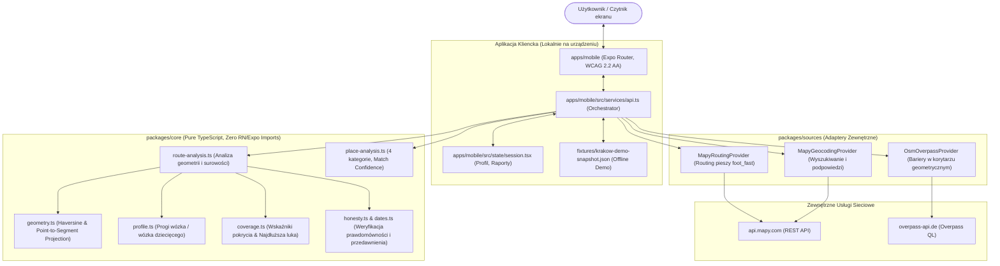

# Architektura Systemu – Kraków bez barier

## 1. Dwa zestawy kryteriów i zgodność

Regulamin konkursu (Rules) jest nadrzędny wobec briefu miasta tam, gdzie wagi się różnią:

| Obszar oceny | Regulamin (Jury) | Brief miasta (KRYTERIA) | Realizacja w architekturze |
| :--- | :--- | :--- | :--- |
| **Pomysł / użyteczność** | Idea 30% | Użyteczność 25% | Wyznaczenie trasy pieszej z Mapy.com weryfikowane na żywo z OSM; zero fałszywych obietnic |
| **Technika i jakość kodu** | Technical 30% | Prototyp 20% | 100% czysty TypeScript, 36 testów jednostkowych (T1–T8), pełna obsługa błędów i korytarza geometrii |
| **Architektura i skalowalność** | Design 20% | Skalowanie 20% | Monorepo npm, całkowita separacja warstw, dodanie nowego miasta w 1 pliku JSON |
| **Zgodność z kategorią** | Relation 10% | Wiarygodność 15% | Wymóg konkretnych barier z datą, źródłem i dowodem zamiast etykiety „dostępne / niedostępne” |
| **Efekt WOW** | WOW 10% | — | Synteza mowy (`expo-speech`), interaktywna mapa z pinezkami barier, panel symulacji demo |
| **Model biznesowy** | w pomyśle i skalowaniu | Biznes 20% | Architektura Backendless / Thin Proxy, widżet B2B dla turystyki, zerowy koszt serwerów dla UMK |

---

## 2. Przepływ Danych (Data Flow Diagram)



---

## 3. Kluczowe Zasady Architektoniczne

### A1. Separacja akwizycji i prezentacji
Warstwa prezentacji (`apps/mobile`) importuje wyłącznie typy domenowe i interfejsy z `packages/core`. Interfejs użytkownika nie zna składni Overpass QL, nazw tagów OSM (`highway=steps`, `barrier=kerb`) ani formatu JSON z `api.mapy.com`. Wszystkie dane zewnętrzne są normalizowane do ujednoliconego modelu `Fact`.

### A2. Ujednolicony model dowodowy (`Fact`)
```typescript
interface Fact {
  id: string;
  subject: { type: 'place' | 'segment' | 'crossing' | 'entrance'; ref: string; lat: number; lon: number };
  criterion: string;
  value: string;
  unit?: string;
  status: 'verified' | 'community' | 'reported' | 'inferred' | 'unknown' | 'conflicting';
  source: { name: string; url: string; licence: string; objectId?: string; objectVersion?: string };
  retrievedAt: string;
  lastEditedAt?: string;
  lastConfirmedAt?: string;
  matchConfidence?: number;
}
```

### A3. Status faktu i ochrona przedawnienia
- Dane z OpenStreetMap domyślnie otrzymują status `community`.
- Status `verified` przysługuje **wyłącznie** wtedy, gdy obiekt posiada znacznik potwierdzenia (`check_date:*`, `survey:date`) mieszczący się w progu świeżości z konfiguracji miasta (domyślnie ≤ 24 miesiące).
- Data edycji (`timestamp`) w OSM jest wyraźnie oznaczana jako „ostatnia edycja w OSM” i nigdy nie jest utożsamiana z potwierdzeniem braku barier.

### A4. Rozwiązywanie konfliktów danych (R7)
Funkcja `findConflicts(facts)` grupuje fakty według `[subject.ref, criterion]`. Jeśli różne obiekty podają sprzeczne wartości dla tej samej cechy (np. budynek oznaczony jako `wheelchair=yes`, ale węzeł drzwi wejściowych posiada `wheelchair=no` z powodu 5 stopni), aplikacja zachowuje obie wartości, nadaje im status `conflicting` i prezentuje je użytkownikowi w czytelnym ostrzeżeniu.

### A5. Odporność na awarie i panel demo (A8, R12)
- Obsługa błędów sieciowych: kody HTTP 401, 403, 404, 422, 429 (rate-limit), 5xx oraz timeouty mapowane są na typowany błąd `SourceFailure`.
- W przypadku braku połączenia lub awarii serwera zewnętrznego, aplikacja nie pokazuje fałszywego „braku barier” – wyświetla wyraźny komunikat ostrzegawczy i serwuje zweryfikowany lokalny snapshot demonstracyjny (`fixtures/krakow-demo-snapshot.json`).
- Wbudowany panel testowy (`🛠️ Demo`) pozwala jurorom w dowolnym momencie wymusić awarię Overpass lub Mapy.com w celu demonstracji odporności systemu na żywo.

---

## 4. Rozszerzalność (Extensibility)

1. **Dodanie nowego miasta:**
   Wystarczy utworzyć plik `cities/<nazwa>.json` z granicami geograficznymi (`bbox`), progami barier oraz wybranymi adapterami, a następnie wskazać go w konfiguracji. Nie wymaga to modyfikacji kodu aplikacji.
2. **Dodanie nowego źródła danych:**
   Wystarczy zaimplementować interfejs `AccessibilityDataSource` w `packages/sources` (np. adapter do Miejskiego Systemu Informacji Przestrzennej UMK) i zarejestrować go w konfiguracji miasta.
3. **Dodanie nowej kategorii barier:**
   Zasady mapowania tagów znajdują się w `packages/core/src/route-analysis.ts` oraz `place-analysis.ts`, co pozwala łatwo rozszerzyć analizę o kolejne parametry (np. audiodeskrypcje, pętle indukcyjne).
