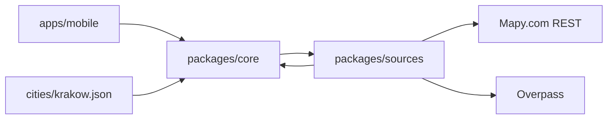

# Architektura

## Dwa zestawy kryteriów

Regulamin konkursu (Rules) jest nadrzędny wobec briefu miasta tam, gdzie wagi się różnią.

| | Regulamin (jury) | Brief miasta (KRYTERIA) |
| --- | --- | --- |
| Pomysł / związek z wyzwaniem | Idea 30% | Użyteczność 25% |
| Technika | Technical 30% | Prototyp 20% |
| Architektura i wdrożenie | Design 20% | Skalowanie 20% |
| Zgodność z kategorią | Relation 10% | — |
| Efekt | WOW 10% | — |
| Dane | w technice i pomyśle | Wiarygodność 15% |
| Biznes | w pomyśle i skalowaniu | Biznes 20% |

Minimum z regulaminu: 50% punktów. Zgłoszenie na HackTribe po polsku: tytuł, ID zespołu, opis, PDF do 10 slajdów, wideo do 3 minut. Praca od 11:00 3 października 2026 do 11:00 4 października 2026.

Brief miasta wymaga tego samego produktu: konkretne bariery zamiast „dostępne/niedostępne”, źródło, data, wiarygodność, brak pytania o niepełnosprawność, działanie poza systemami UMK, oraz plan utrzymania i komercjalizacji (hotele, organizatorzy, zarządcy, systemy rezerwacji, mapy).

## Przepływ danych

UI zna typy i interfejsy z `core` (`RoutingProvider`, `GeocodingProvider`, `AccessibilityDataSource`, `TileProvider`). Nie zna składni Overpass, tagów OSM ani kształtu JSON Mapy.com. Implementacje są w `packages/sources`.

Dodanie miasta = nowy plik `cities/<id>.json`. Dodanie źródła = nowy adapter i wpis w `adapters`. Progi wózka i wózka dziecięcego są w konfiguracji, nie w komponentach.

## Mapa

Domyślne kafelki: zestaw Mapy.com `basic`. Szablon URL kafelka ma przyjść z funkcji tiles.json, a nie z zahardkodowanego adresu. Pobranie OpenAPI kafelków (`https://api.mapy.com/v1/docs/maptiles/openapi.yaml`) 3 października 2026 zwróciło HTTP 500, więc ścieżki tej funkcji jeszcze nie wpisujemy.

`expo-maps` nie jest w Expo Go i nie ma warstwy kafelków rastrowych. Wybór na prototyp: `react-native-maps` (jest w Expo Go, SDK 55). Render polilinii i kafelków Mapy.com trzeba potwierdzić na urządzeniu albo emulatorze, zanim oprzemy na tym demo. Lista barier zostaje głównym interfejsem; mapa jest dodatkiem i musi mieć odpowiednik tekstowy.

Kafelki OSM (`https://tile.openstreetmap.org/{z}/{x}/{y}.png`) są dozwolone tylko jako opcja demo i tylko zgodnie z [Tile Usage Policy](https://operations.osmfoundation.org/policies/tiles/): identyfikujący User-Agent, cache, bez zgrywania obszaru offline, atrybucja na mapie. Nie są domyślne.

## Trasa

`GET https://api.mapy.com/v1/routing/route` z `routeType=foot_fast`. W enum OpenAPI 2.1.14 nie ma profilu wózka ani wózka dziecięcego. Nie ma parametru alternatywnych tras; jest do 15 waypointów. Klucz idzie w nagłówku `X-Mapy-Api-Key`.

Analiza geometrii wobec OSM jest kolejnym krokiem. Czyste funkcje progów, konfliktów, dat i pokrycia są już w `core` i mają testy.

## Status faktu

`verified` tylko przy świeżej dacie kontroli w progu z konfiguracji (domyślnie 24 miesiące). Sama data edycji OSM to status `community` i etykieta „ostatnia edycja w OSM”. `unknown`, `conflicting` i `reported` nie mogą być pokazane jako brak problemu.

## Założenia niepotwierdzone

- ID zespołu nie zostało podane (`teamId: null`).
- Obszar demo to przykład z briefu budowy, oznaczony jako wstępny.
- Bbox Krakowa to robocze przybliżenie, nie granica UMK.
- Progi krawężnika, szerokości, nachylenia i listy nawierzchni są decyzją produktu. Nie są normą medyczną ani wytyczną miasta. Wartości nawierzchni nie zostały jeszcze sprawdzone w wiki OSM.
- Próg pokrycia 0,8 dla zdania „nie znaleziono przeszkód w dostępnych danych” jest decyzją produktu.
- `placeMatchMaxMetres` 40 jest decyzją produktu.
- HTTP 429 nie występuje w liście odpowiedzi routingu OpenAPI 2.1.14. Mapujemy go mimo to, bo spec opisuje limit zapytań.
- User-Agent Overpass nie ma jeszcze maila kontaktowego zespołu. Trzeba go dodać przed żywymi zapytaniami.
